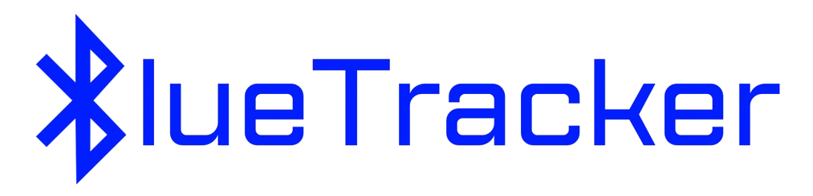

  

 

# BlueTracker
A C script that uses Bluetooth signals to detect and measure the distance to nearby devices. Ideal for tracking and proximity-based applications,
it supports continuous scanning and distance updates for enhanced accuracy and real-time monitoring.

 

## Documentation
For detailed documentation on installation, usage, and more about BlueTracker, visit our [Wiki](https://github.com/olivercalazans/BlueTracker/wiki).
  
 

## Installation
To simplify the setup process, a bash script has been provided to automatically install and configure everything. Simply run the [setup.sh](setup.sh) script for an automatic installation. If you prefer to set everything up manually, you can follow the instructions detailed in the [Wiki](https://github.com/olivercalazans/BlueTracker/wiki/Installation).

 

## License
This project is licensed under the MIT License. See the [LICENSE](LICENSE) file for details.
